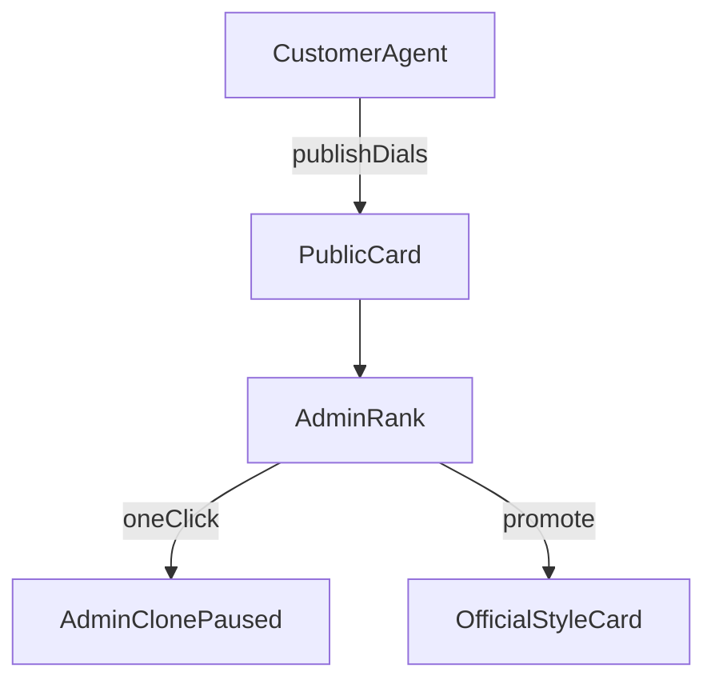

# Admin

Admin is an extra nav on the same app. The admin account is also a normal user: it connects its own production key and runs its own agents. Admin actions do not decrypt another customer's PEM, and there is no "log in as user".

Seed the admin role from `ADMIN_EMAILS` on first login. Everyone else is `user`.

## Controls

Overview:

- Worker heartbeat
- Age of the public BTC tape
- Agents running
- Live orders in the last hour
- Global halt

Users:

- Email, tier, production key connected (yes or no), agents running
- Set tier, including comp to Pro without Stripe
- Disable the account, which pauses their agents and blocks arming
- Pause one of their agents
- Grant one extra free market, once per use of the button, without comping the month

Feed:

- The latest decision sentence per running agent
- Reason text only

Global halt stops new live orders on the next cycle and cancels resting live orders. Those cancels go through the same reconciler as any other cancel. Halt does not stop paper. A paper agent that goes silent looks like a dead app.

Every halt, comp, disable, pause, grant, clone, promote, hide, and release writes an `admin_audit` row.

## Intelligence

One page, two lists: Working and Not working. A row is a published agent, or a cluster of published agents whose dials match.

Each row shows:

- Style, and the dials that differ from the official preset
- Live settled markets, reconciled P&L, hit rate
- Unknown-order rate
- Demo results in a separate column that does not affect the list

Demo never moves a row between Working and Not working. Demo books are not the production 15-minute market.

An agent is not ranked until it has at least 20 reconciled live settlements. Paper fills are a setup test, not a result.

Not working has two reasons:

- **Lost.** Orders reconciled and live P&L is negative. The rules did what they were set to do.
- **Broken.** Unknown orders, `401`, `403`, or a red settings card. The agent never got a fair run. It stays out of the strategy ranking and shows on that user's admin row.

Working means reconciled live P&L is positive after those 20 settlements, and the unknown-order rate is near zero.

## What admin can create

A private note on a cluster, plus three actions.

- **Release** puts the admin's sentence on the public card. It does not put the customer's dollar P&L on the card.
- **Promote** copies that cluster's dials into a new official style card on the create screen. Window, Swing, and Decay stay. The new card is named by the admin.
- **Hide** pulls a published agent off the gallery.

**Clone** is one click on either list. It copies that published agent's name, style, and dials onto a new agent on the admin account. The clone is paused and bound to the admin's production key. The source customer's key, fills, and later dial changes stay theirs.

Run on the clone still waits until the admin's Demo card is green. If the admin already has a running agent on that series, the clone stays paused beside it. Arming the clone live is a separate action, the same as any other agent.

Customers may clone a public card the same way, onto their own account. They do not see the Working and Not working lists. They do not see another customer's P&L. They cannot subscribe to another customer's live orders.
