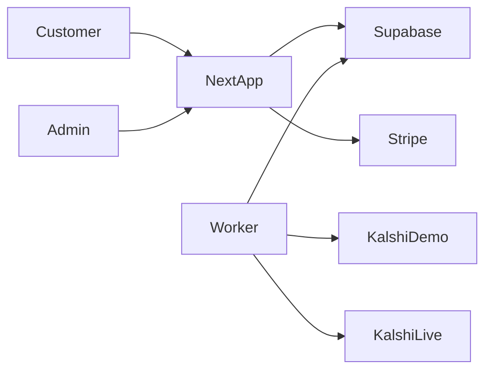

# Architecture

The app is one Next.js service and one worker. Supabase holds auth and Postgres. Stripe is one plan. Kalshi demo and Kalshi production are separate hosts and separate keys.

The app is not built yet. This document is what the first build has to match.

## System

The customer and the admin use the same web app. Admin is a role, not a second product.

The web app writes config, keys, and the halt switch. It does not place strategy orders. The worker places orders and reconciles them.

The web app never holds a raw PEM in the browser after save. Encryption is AES-256-GCM with `CREDENTIALS_KEY` on the server only.

## Processes

**Web.** Login, the Kalshi cards, agent create and edit, the decision log, Stripe checkout, and the admin pages. Auth is Supabase magic link. The browser uses the anon key for login. Agent rows, credentials, and orders are read and written by the server.

**Worker.** One Railway process.

- Poll public market data once per series and cache it. That cache is the tape: the open 15-minute market, the hourly strike chain, Binance last, and Coinbase spot.
- For each running agent, call `decide(snapshot, params)`. That function does not touch the network. It returns skip, enter, or exit, plus one sentence.
- Write the decision.
- If the action is enter or exit, and the gates in [SETTINGS.md](SETTINGS.md) pass, hand the order to the lifecycle in [ORDER-LIFECYCLE.md](ORDER-LIFECYCLE.md).
- Private Kalshi calls (balance, positions, orders, fills) happen only for users with a running agent, staggered, against that agent's bound host.

Two workers must not double-send. An agent row carries a lease timestamp. A cycle that cannot take the lease does not submit.

## Tape and keys

Public market data is fetched once and shared. A 1.5 second order-book poll per customer dies at a few dozen users. Kalshi's public read budget is shared.

Demo agents talk only to `https://external-api.demo.kalshi.co/trade-api/v2`. Live agents talk only to `https://external-api.kalshi.com/trade-api/v2`. The worker selects the host from the credential row, not from a global flag.

## Data model

- `profiles` — id matches the auth user, role (`user` or `admin`), tier (`free` or `pro`), disabled flag
- `kalshi_credentials` — one demo row and one live row per user, key id, encrypted PEM, last balance, last error, checklist timestamps
- `agents` — user, name, strategy (`btc_15m` or `btc_hourly`), style, `params` jsonb, mode (`paper` or `live`), status (`paused` or `running`), armed, published flag
- `order_intents` — agent, `client_order_id` unique, ticker, side, price, count, status, Kalshi `order_id`, submit time
- `decisions` — agent, time, action (`skip`, `enter`, `exit`, or `shadow`), one sentence
- `app_settings` — one row, `halt_live`
- `admin_audit` — actor, action, target, time
- `intelligence_notes` — cluster key, private note, optional released sentence

`params` is validated with a Zod schema per style. The form is rendered from that schema. Adding a sport later is a schema, a `decide` function, and a preset. It is not a new app.

Row-level security locks each user to their own rows so a leaked anon key cannot list the table. Admin pages use the server after a role check. They do not select the PEM column.

## Quotas

The worker counts a free-tier market when that demo window settles, not when the customer clicks Arm. Shadow decisions still run after the third settlement. They do not create intents. An open position keeps its get-out intents until it settles. The bonus market for an all-skip account is a counter on `profiles`, granted once automatically, and grantable again by an admin.

## Out of v1

- Sports
- An LLM in the decision path
- A blank rule builder
- The hotkey cockpit
- Impersonation
- A local paper fill
- Subscribing to another customer's live orders
- Auto-publishing standings or dollar P&L

Presets and dials: [PRESETS.md](PRESETS.md). Admin ranking and clone: [ADMIN.md](ADMIN.md).
