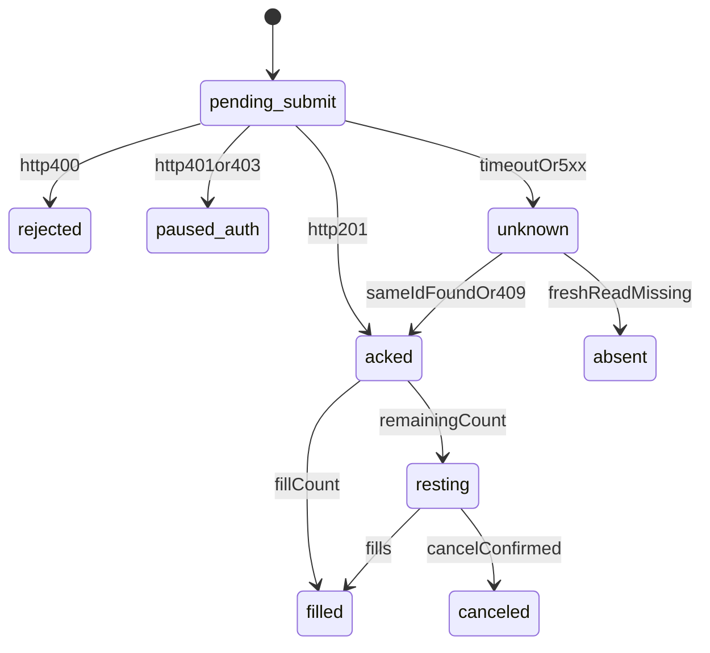

# Order lifecycle

Every bid is a row, written before the HTTP call. The worker does not treat a missing response as a failed order, and it does not treat a missing read as proof the bid never landed.

Create goes to Kalshi V2:

`POST /portfolio/events/orders`

The legacy `POST /portfolio/orders` path is not used. Prices are dollar strings (`"0.4400"`). Counts are strings (`"3.00"`). Side is `bid` or `ask` on the YES book. `time_in_force` is `good_till_canceled` unless a preset says otherwise. `self_trade_prevention_type` is `taker_at_cross`. `cancel_order_on_pause` is true, so an exchange pause pulls a resting bid.

`client_order_id` is a UUID stored on the intent row first. Kalshi uses it to deduplicate. A second submit with the same id returns `409`. That `409` means the first bid landed.

## States

A `201` body includes `order_id`, `fill_count`, and `remaining_count`. `fill_count` above zero is an immediate fill. `remaining_count` above zero is a resting remainder. Both can be true on a partial.

## Responses

| Response | Status | What happens next |
|---|---|---|
| `201` | `acked` | Store `order_id`. Split fill and remainder from the body. |
| `409` | `acked` once the lookup hits | The bid is already on Kalshi. Look it up by `client_order_id`. Do not create a new id. |
| `400` | `rejected` | Show Kalshi's message. Do not retry. Usual cause is price, size, or balance. |
| `401` | `paused_auth` | Pause the agent. The key or the signature is wrong. |
| `403` | `paused_auth` | Pause the agent. This key can read and cannot trade. The settings card goes red. |
| `429` | stays `pending_submit` | Back off. Resubmit the same `client_order_id`. |
| Timeout, `500`, `503`, empty body, HTML, bad JSON | `unknown` | Resubmit the same id once, then reconcile. No second order. |

The sentence on the agent page while status is `unknown`: "The order call dropped. Checking whether the bid landed. Not sending another." A `500` uses "Kalshi returned a bad response. Checking whether the bid landed. Not sending another."

## Paper simulator

Paper uses the same intent row and the same states. The HTTP call is `paperRequest` in `src/lib/paper.ts`, not Kalshi. Fate is `sha256(client_order_id)[0] % 10`:

- `0–1` drop. The order is inserted with `visible_at` eight seconds ahead, then the call throws. A retry of that id is `409`. A list or get before `visible_at` misses it. `as_of_time` is thirty seconds behind while any order is still hidden. Cancel of a hidden order is `503`.
- `2` server error. `500`, no row. After `as_of_time` passes the submit time, the intent becomes `absent`.
- otherwise `201` resting, fill `0`. Fifteen seconds after it is visible, a read reports it executed.

Probe rows created while saving a key are deleted before the checklist returns. They are not strategy intents.

## Read lag

Balance, orders, fills, and positions lag the matching engine. `GET /exchange/user_data_timestamp` returns `as_of_time`, the approximate time those reads were last validated.

"Not in the order list" is meaningless until `as_of_time` is later than the intent's submit time. Until then the intent stays `unknown`. A new `client_order_id` is allowed only after that fresh read still does not contain the id. The status on that path is `absent`, and only then may the strategy submit a new intent.

## Reconciler

Every worker cycle, for intents in `pending_submit`, `unknown`, `acked`, or `resting`:

1. `GET` the order if `order_id` is already stored.
2. Otherwise list orders and match `client_order_id`.
3. Read fills for that order.
4. If the list is fresh and the id is absent, mark `absent`.
5. A confirmed cancel moves `resting` to `canceled`. An unconfirmed cancel stays `unknown` and blocks a replacement order on that agent.

Global halt cancels resting live orders and waits for those cancels to reconcile. It does not only skip the next decision.

A position change with no matching intent is an `admin_audit` exception, not a silent attach. The worker attaches a position to an `unknown` intent only when the ticker and the contract count match that one intent.

## What the customer sees

- "Bid sent. Waiting to see it on Kalshi."
- "Bid is resting at 44¢."
- "Filled 3 at 44¢."
- "Kalshi rejected the bid: insufficient balance."
- "This key can read the account and cannot place orders."

Shadow lines after the free quota are decisions. They do not create intent rows.
