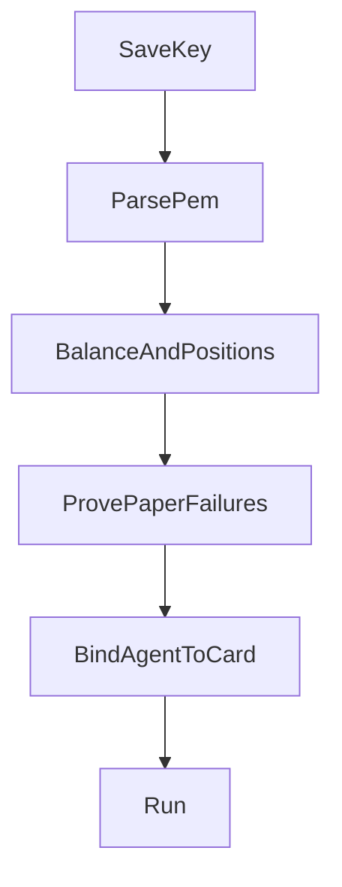

# Settings

Run stays disabled until the key card the agent is bound to is green. The agent page shows the first red row as a sentence. The customer fixes it on the Kalshi page. They do not discover a bad key at minute 12 of a window.

## One card

The Kalshi page stores a production key:

- API key id
- Encrypted private key PEM
- Last balance
- Last error
- Checklist

After save, the PEM field stays empty. The server never sends the PEM back.

Reads use `https://external-api.kalshi.com/trade-api/v2`. Paper orders do not. There is no demo host.

## Checklist

Each row has to pass, in order.

1. **PEM parses.** Accept Ed25519 and RSA-PSS. Kalshi's create-key screen defaults to Ed25519. A PEM that does not parse stays red. The customer pastes the key again. There is no second chance to fetch it from Kalshi.
2. **Key id is stored.**
3. **Balance call succeeds** on the production host.
4. **Positions call succeeds.** A balance-only key can pass step 3 and then return `403` on a real create. Positions is a stronger read. It is still not proof of trade permission.
5. **Paper failure check.** The simulator must time out a create that still lands, answer the same `client_order_id` with `409`, return `500` for a create that leaves no row, hide that order from a list, lag `as_of_time`, and refuse a cancel of an order that is not visible yet. This check does not post to Kalshi.
6. **Balance covers the size dial** at the prices the preset is allowed to bid.
7. **Exchange status is not paused.**
8. **One running agent per series per user.** A second agent on the same series can be saved. It cannot be running at the same time.

Sentences for the failures a customer will actually hit:

- "This key can read the account and cannot place orders."
- "Balance is $4. The size dial needs $12."
- "The private key did not parse. Paste the PEM Kalshi showed you once."
- "The dropped-call case did not time out."

## Arm

Arm is a separate switch, default off. Live orders require all of:

- Mode is live
- Armed is on
- Tier is Pro, or an admin comp
- The Live card is green
- The user is not disabled
- Global halt is off
- The daily loss cap is not hit

Paper orders require the production card green and the agent running. They do not require Pro. They do count toward the three-market free quota. They do not leave the server.

## The failure check is not a bet

Save and test proves the simulator, then deletes the probe rows. A dropped paper create uses the same `client_order_id` on the retry. The card stays red if that retry is not a `409`, if the `500` case inserts a row, or if a lagged order is visible too early.
