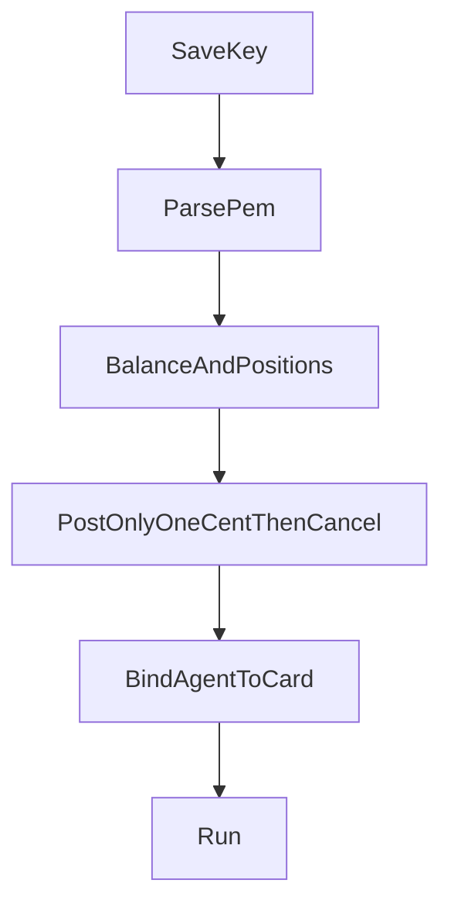

# Settings

Run stays disabled until the key card the agent is bound to is green. The agent page shows the first red row as a sentence. The customer fixes it on the Kalshi page. They do not discover a bad key at minute 12 of a window.

## Two cards

The Kalshi page has two cards, Demo and Live.

Each card stores:

- API key id
- Encrypted private key PEM
- Last balance
- Last error
- Checklist timestamps

After save, the PEM field stays empty. The server never sends the PEM back.

An agent binds to one card. Paper binds to Demo. Live binds to Live. A demo key cannot arm live. A production key cannot run paper.

Demo host: `https://external-api.demo.kalshi.co/trade-api/v2`

Production host: `https://external-api.kalshi.com/trade-api/v2`

Kalshi does not share credentials between those environments.

## Checklist

Each row has to pass, in order.

1. **PEM parses.** Accept Ed25519 and RSA-PSS. Kalshi's create-key screen defaults to Ed25519. A PEM that does not parse stays red. The customer pastes the key again. There is no second chance to fetch it from Kalshi.
2. **Key id is stored.**
3. **Balance call succeeds** against that card's host.
4. **Positions call succeeds.** A balance-only key can pass step 3 and then return `403` on create. Positions is a stronger read. It is still not proof of trade permission.
5. **Write probe.** Buy 1 contract at `$0.01`, `post_only`, on an open market, then cancel, then reconcile both the create and the cancel through the order lifecycle in [ORDER-LIFECYCLE.md](ORDER-LIFECYCLE.md). If the cancel is still unknown, the card stays red. The Live card uses the same probe. The copy on that button says the app will place a 1¢ order and cancel it.
6. **Balance covers the size dial** at the prices the preset is allowed to bid.
7. **Exchange status is not paused.**
8. **One running agent per series per user.** A second agent on the same series can be saved. It cannot be running at the same time.

Sentences for the failures a customer will actually hit:

- "This key can read the account and cannot place orders."
- "Demo balance is $4. The size dial needs $12."
- "The private key did not parse. Paste the PEM Kalshi showed you once."
- "This demo key was rejected by the live host. Live needs a production key."

## Arm

Arm is a separate switch, default off. Live orders require all of:

- Mode is live
- Armed is on
- Tier is Pro, or an admin comp
- The Live card is green
- The user is not disabled
- Global halt is off
- The daily loss cap is not hit

Paper (demo) orders require the Demo card green and the agent running. They do not require Pro. They do count toward the three-market free quota.

## Probe orders are real

The 1¢ probe is a real order on that environment. It uses the same intent row and the same reconciler as a strategy order. A probe that times out does not get a second `client_order_id`. The card stays red until the reconciler knows whether it landed and whether the cancel landed.
